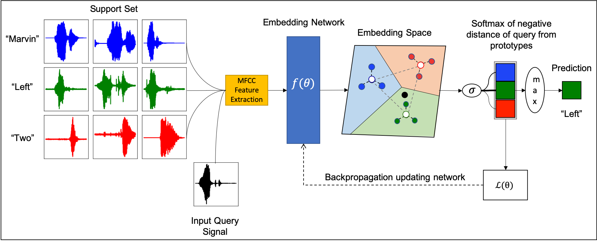

Code Repository for the paper "Few-Shot Keyword Spotting with Prototypical Networks".




# Installation

1. Clone the repository:  

    ```
    git clone https://github.com/ArchitParnami/Few-Shot-KWS 
    ``` 

2.  Create a conda environment:

    ```
    conda create -n FS-KWS
    ```

3.  If pip not installed, install pip by:

    ```
    conda install pip
    ```

4.  Install the required packages:

    ```
    pip install -r requirements.text
    ```

5.  Install the protonets package:

    ```
    cd Few-Shot-KWS
    python setup.py develop
    ```

# Download & Prepare Few-Shot Keyword Spotting Dataset

```
cd Few-Shot-KWS/data/
python download_prepare_data.py
```
# Train

To train a simple 2-way 1-shot experiment.

```
cd Few-Shot-KWS/scripts/train/few-shot/fewshotspeech
./train.sh 2 1 0 mymodel
```
Specify arguments to train.sh in the following manner

train.sh num_ways num_shots exp_type exp_id

- num_ways  
    + Number of classes
    + Eg. 2 or 4
- num_shots
    + Number of samples per class.
    + Eg. 1,5
- exp_type
    + Number indicating the type of experimental setup
        - 0 = Simple N-Way K-Shot Setup. No background, silence or unknown keywords.
        - 1 = Include Background
        - 2 = Include Silence
        - 3 = Include Unknown 
        - 4 = Background + Silence 
        - 5 = Background + Unkown
        - 6 = Unknown + Silence
        - 7 = Background + Silence + Unknown
- exp_id
    + identifier = directory name
    + results are saved in `Few-Shot-KWS/scripts/train/few-shot/fewshotspeech/results/[exp_id]`


# Evaluate

```
cd Few-Shot-KWS/scripts/predict/few-shot
python eval_results.py ../../train/few_shot/fewshotspeech/results/
```

The evaluation can be found in:  
```
cat Few-Shot-KWS/scripts/train/few-shot/fewshotspeech/results/[exp-id]/[timestamp]/eval.txt
```

